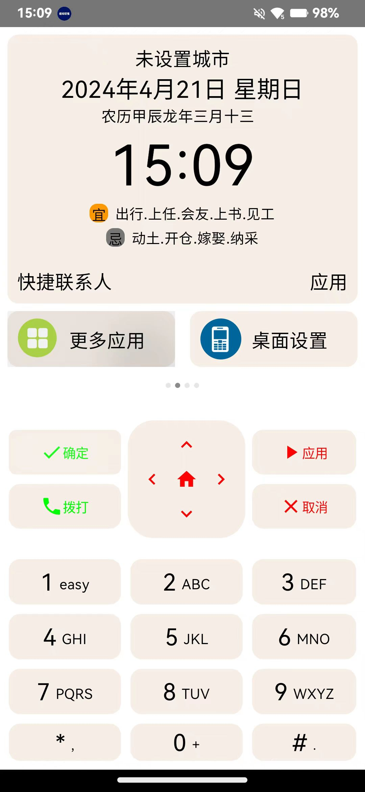
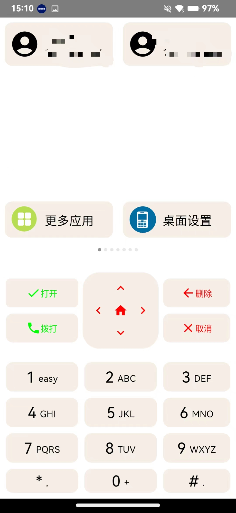
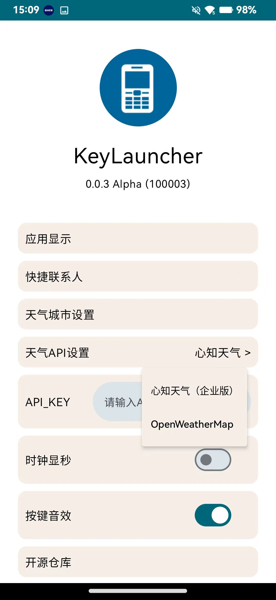
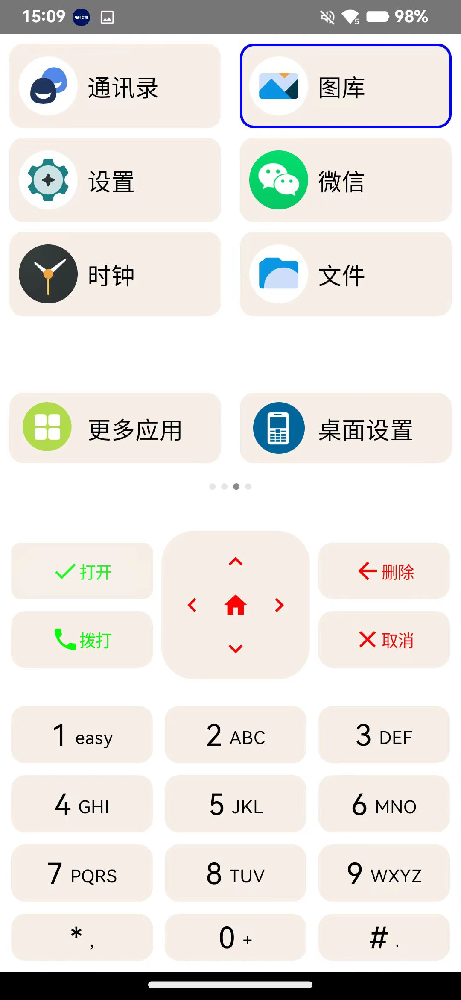
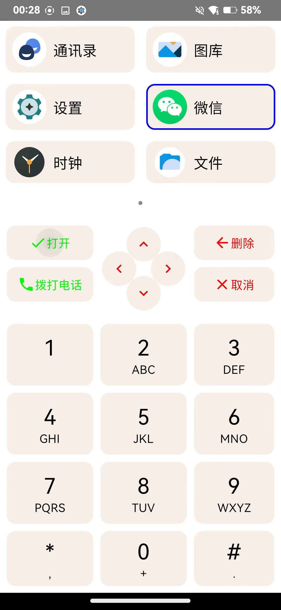

# KeyLauncher 功能机启动器

## 1. 项目简介
1. 本项目是一个功能机启动器，主要功能是在android手机上模拟功能机的启动器，提供类似功能机的启动器界面，支持自定义快捷联系人，快捷应用，按键音效等。
2. 本项目是一个开源项目，欢迎大家一起参与开发，提出建议，共同完善。
3. 本软件基于GPLv3协议开源，任何人可以免费使用，分发衍生产品必须使用GPLv3协议。

## 2. 项目特点
1. 支持自定义快捷联系人，快捷应用，按键音效等。
2. 支持天气展示，可选定心知天气（企业版）和OpenWeatherMap天气。需要自行申请API Key。
3. 按键音效基于 TextToSpeech，需要设备安装语音引擎。

## 3. 项目截图

## 4. 项目编译
1. 本项目使用Android Studio开发，编译前请安装Android Studio。

## 5. 项目使用
1. 本项目使用Android Studio开发，编译后安装到手机上即可使用。
2. 本项目使用了天气功能，需要自行申请心知天气（企业版）和OpenWeatherMap天气的API Key，填写到项目中。
